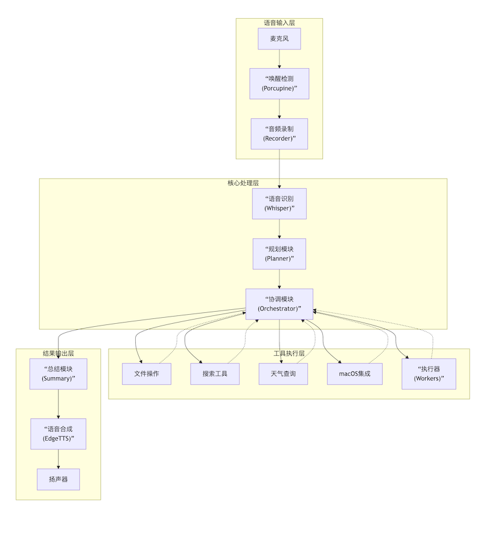

# VoxAgent 项目文档

## 目录

- [项目概述](#项目概述)
- [快速开始](#快速开始)
- [产品设计](#产品设计)
- [技术架构](#技术架构)
- [实现挑战与解决方案](#实现挑战与解决方案)
- [模型选择](#模型选择)
- [未来规划](#未来规划)

---

## 项目概述

VoxAgent 是一个基于 LangChain/LangGraph 的智能语音桌面助手，结合了现代 AI Agent
架构与实用的计算机自动化能力。通过语音交互，用户可以完成文件操作、信息检索、天气查询、图像生成、
系统APP控制等多种任务。

**核心特性：**

- 🎤 本地语音唤醒与识别 — 隐私优先，高效响应
- 🤖 多 Agent 智能协作 — 基于 LangGraph 高效编排
- 🔧 丰富工具生态 — 20+ 工具，覆盖多场景
- 💻 深度跨平台集成 — 支持 macOS & Windows 的 Mail、Media 控制
- 📊 LangSmith 全链路监控 — 性能与行为可视化

---

## 快速开始

### 系统要求

**最低配置：**

- Python 3.9+
- 8GB RAM
- 麦克风设备

**推荐配置：**

- macOS 系统（完整功能）
- 16GB RAM

### 安装步骤

**1. 克隆项目并创建环境**

```bash
git clone https://github.com/JarrettGuo/VoxAgent.git
cd voxagent
python3 -m venv venv
source venv/bin/activate  # macOS/Linux
```

**2. 安装依赖**

```bash
pip install -r requirements.txt

# macOS 额外依赖
brew install portaudio ffmpeg
```

**3. 配置环境变量**

复制 `.env.example` 为 `.env`，填入必需的 API Key：

```bash
# 必需
PORCUPINE_ACCESS_KEY=your_key        # 唤醒词检测
QINIU_API_KEY=your_key               # 七牛云 LLM

# 可选
GAODE_WEATHER_API_KEY=your_key       # 天气查询
OPENAI_API_KEY=your_key              # 图像生成
GOOGLE_SERPER_API_KEY=your_key       # 网络搜索
LANGSMITH_API_KEY=your_key           # 监控追踪
```

**获取 API Key：**

- Porcupine: https://console.picovoice.ai/
- 七牛云: https://portal.qiniu.com/
- 高德地图: https://lbs.amap.com/
- OpenAI: https://platform.openai.com/api-keys
- Google Serper: https://serper.dev/

**4. 启动程序**

```bash
python src/main.py
```

### 使用示例

```
你：Hi Computer（唤醒）
你：查询北京明天天气
系统：北京明天多云，温度 15 到 25 度，东南风 3 级

你：Hi Computer（唤醒）
你：搜索 Python 装饰器的用法
系统：Python装饰器是一种设计模式，允许在不修改函数代码的情况下增加功能...

你：Hi Computer（唤醒）
你：在桌面创建文件 notes.txt
系统：好的，我已经在桌面创建了文件 notes.txt
```

---

## 产品设计

### 功能需求与优先级

我们将功能划分为三个优先级层次：

#### P0 - 核心功能（必须实现）

**1. 语音交互系统**

- **语音唤醒**：本地唤醒词检测（Porcupine），支持 "computer" 和 "jarvis"
- **语音识别**：本地 Whisper 模型，隐私保护，支持动态时长录音（2-60秒）和静音检测（2秒）
- **语音合成**：Edge TTS 提供自然的中文语音反馈

**优先级理由：** 作为语音助手，这是用户交互的唯一入口，没有语音能力就无法使用。本地处理保护隐私，是核心竞争力。

**2. 多 Agent 协作系统**

- **PlannerAgent**：理解用户意图，生成结构化执行计划
- **TaskOrchestrator**：基于 LangGraph 的任务编排器
- **专业执行 Agent**：文件操作、搜索、天气查询、APP控制、文生图等专业 Agent

**优先级理由：** 多 Agent 架构是系统智能化的基础，决定了任务执行的准确性和灵活性。

**3. 对话管理与错误处理**

- 多轮对话支持
- 上下文理解与意图合并
- 错误分析与友好反馈
- 语音识别纠错

**优先级理由：** 语音识别不可能 100% 准确，完善的错误处理和对话管理是实用性的关键。

#### P1 - 高频工具（优先实现）

**1. 文件操作**

- 创建、读取、追加、删除文件
- 文件搜索与目录列表
- 跨平台路径处理

**优先级理由：** 日常使用频率最高，几乎所有工作流都涉及文件操作。

**2. 信息检索**

- Wikipedia 百科查询
- DuckDuckGo 网络搜索
- Google Serper 实时搜索

**优先级理由：** 信息查询是助手的核心价值之一，使用频率仅次于文件操作。

**3. 天气查询**

- 高德天气 API（中国城市）
- 谷歌搜索天气（国际城市）

**优先级理由：** 高频刚需，查询天气是语音助手的典型场景。

#### P2 - 增强功能（逐步完善）

**1. 图像生成**

- DALL·E 3 文生图
- 自动下载到桌面

**优先级理由：** 创意工具，使用频率较低但增强产品竞争力。

**2. 系统控制**

- 应用启动/关闭（Chrome、微信、VSCode 等）
- 邮件管理（搜索、阅读、发送）
- 特定音乐播放控制
- Media 播放控制（暂停、播放、下一首）

**优先级理由：** 便捷但非刚需，可通过快捷键替代。

### 本次开发完成情况

✅ **已实现所有 P0 和 P1 功能**

- 完整的语音交互系统（唤醒、识别、合成）
- 多 Agent 架构与 LangGraph 编排
- 对话管理与错误处理
- 文件操作、信息检索、天气查询、跨平台支持

✅ **已实现大部分 P2 功能**

- 图像生成与自动下载
- 系统应用控制
- 邮件管理基础功能
- 音乐播放控制
- Media 播放控制

📊 **功能完成度：95%**

---

## 🏗️ 技术架构

### 整体架构



### 三层架构详解

#### 1️⃣ Audio Layer - 音频处理层

**核心模块：**

- `WakeWordDetector`：Porcupine 本地唤醒检测
- `AudioRecorder`：动态时长录音（2-60秒）+ 静音检测（2秒）
- `WhisperASR`：本地语音识别（Whisper）
- `EdgeTTS`：文本转语音合成

**数据流：**

```
麦克风 → Porcupine → 触发录音 → Whisper → 文本（输入）

Summary Agent 处理 → 结果 → EdgeTTS → 扬声器（输出）
```

#### 2️⃣ Agent Layer - 智能体层

**三层 Agent 架构：**

```
┌──────────────────────────┐
│   PlannerAgent (规划)     │  ← Qwen3-Max
│   - 理解用户意图           │
│   - 生成执行计划           │
└──────────────────────────┘
            ↓
┌──────────────────────────┐
│ TaskOrchestrator (协调)   │  ← LangGraph
│   - 状态机管理             │
│   - Agent 路由            │
└──────────────────────────┘
            ↓
┌──────────────────────────┐
│ Specialized Agents (执行) │  ← Qwen3-Next-80B
│   - FileAgent             │
│   - SearchAgent           │
│   - WeatherAgent          │
│   - ImageAgent            │
│   - MacOS Agents          │
└──────────────────────────┘
```

**核心 Agent 列表：**

| Agent               | 功能   | 工具                                      | 优先级 |
|---------------------|------|-----------------------------------------|-----|
| FileManagementAgent | 文件操作 | file_create, file_read, file_delete 等   | 90  |
| SearchAgent         | 信息检索 | wikipedia, duckduckgo, google_serper    | 80  |
| WeatherAgent        | 天气查询 | gaode_weather                           | 80  |
| ImageGenAgent       | 图像生成 | dalle3, image_download                  | 70  |
| MacOSMusicAgent     | 音乐控制 | music_play, music_control, music_search | 60  |
| MacOSMailAgent      | 邮件管理 | mail_search, mail_read, mail_send       | 60  |

#### 3️⃣ Tools Layer - 工具层

**工具分类（20+ 工具）：**

- 文件工具：create, read, append, delete, search, list, find_recent
- 搜索工具：wikipedia, duckduckgo, google_serper
- 系统工具：app_control, gaode_weather
- 多媒体工具：dalle3, image_download
- macOS 工具：mail_*, music_*（AppleScript）

### 核心模块规格

#### 1. BaseAgent - Agent 基类（Gregfujie）

**职责:**

- Agent 自动注册机制
- 平台兼容性检查
- 工具依赖验证
- LangChain AgentExecutor 封装
- 对话历史管理

**关键特性:**

```python
class BaseAgent(Runnable, ABC):
    # 子类必须定义的类属性
    agent_name: ClassVar[str]
    agent_description: ClassVar[str]
    agent_system_prompt: ClassVar[str]

    # 自动注册装饰器
    def __init_subclass__(
            agent_type: str,  # Agent 类型标识
            priority: int,  # 优先级(0-100)
            platforms: Optional[List[str]],  # 支持的平台
            required_tools: Optional[List[str]]  # 必需工具
    )
```

**核心方法:**

| 方法                                    | 说明                   |
|---------------------------------------|----------------------|
| `__init__(llm, tool_manager, config)` | 初始化 Agent,绑定 LLM 和工具 |
| `generate_system_prompt(tools)`       | 动态生成系统提示词            |
| `run(user_input)`                     | 执行任务(同步)             |
| `arun(user_input)`                    | 执行任务(异步)             |
| `reset_conversation()`                | 重置对话历史               |
| `create_all_agents()`                 | 工厂方法,批量创建 Agent      |

**优势:**

1. **零配置注册** — 继承即自动注册,无需手动管理
2. **平台适配** — 自动检测 OS,仅加载兼容的 Agent
3. **依赖检查** — 启动时验证所需工具是否可用
4. **松耦合设计** — 每个 Agent 可使用不同的 LLM 和工具配置
5. **易于扩展** — 新增 Agent 只需 10 行代码

**使用示例:**

```python
class SearchAgent(
    BaseAgent,
    agent_type="search",
    priority=80,
    platforms=["darwin", "linux", "windows"],
    required_tools=["wikipedia_search", "duckduckgo_search"]
):
    agent_name = "search_agent"
    agent_description = "信息检索专家"
    agent_system_prompt = "你是一个信息检索专家..."
```

---

#### 2. PlannerAgent - 任务规划器（JarrettGuo）

**职责:**

- 理解用户自然语言意图
- 分析任务可行性
- 生成结构化执行计划
- 处理多轮对话上下文

**输入/输出格式:**

**输入:**

- `user_query`: 用户查询文本
- `conversation_history`: 可选的对话历史

**输出 (PlannerOutput):**

```json
{
  "task": "用户真实意图",
  "feasibility": "feasible|infeasible|invalid_input",
  "reason": "可行性说明",
  "steps": [
    {
      "step_number": 1,
      "assigned_agent": "file",
      "description": "创建文件",
      "expected_result": "文件创建成功"
    }
  ]
}
```

**核心特性:**

- 使用 Qwen3-Max 进行复杂推理
- 支持对话历史理解(确认词识别、纠正检测)
- 自动识别语音识别错误
- JSON 结构化输出

**关键方法:**

| 方法                                            | 说明              |
|-----------------------------------------------|-----------------|
| `plan(user_query, conversation_history)`      | 异步生成计划          |
| `plan_sync(user_query, conversation_history)` | 同步生成计划          |
| `_parse_response(response)`                   | 解析 LLM 响应为结构化计划 |
| `_convert_to_execution_plan(planner_output)`  | 转换为执行计划         |

---

#### 3. TaskOrchestrator - 任务编排器（Gregfujie）

**职责:**

- 基于 LangGraph 管理执行流程
- 状态机控制任务流转
- Agent 调度与协调
- 执行结果汇总

**LangGraph 工作流:**

```python
workflow = StateGraph(ExecutionState)

# 定义节点
workflow.add_node("initialize", initialize_execution)
workflow.add_node("execute_step", execute_step)
workflow.add_node("finalize", finalize_execution)

# 设置流程
workflow.set_entry_point("initialize")
workflow.add_edge("initialize", "execute_step")
workflow.add_conditional_edges(
    "execute_step",
    route_after_execution,
    {
        "next_step": "execute_step",  # 继续执行
        "all_done": "finalize",  # 完成
        "error": "finalize"  # 错误
    }
)
```

**状态定义 (ExecutionState):**

```python
class ExecutionState(BaseModel):
    plan: Dict[str, Any]  # 执行计划
    steps: List[StepState]  # 步骤状态列表
    current_step_index: int  # 当前步骤索引
    execution_results: List[Dict]  # 执行结果
    completed: bool  # 是否完成
    error_message: str  # 错误信息
```

**执行流程:**

1. **初始化** — 将计划转换为步骤状态
2. **执行步骤** — 路由到对应 Agent → 执行工具 → 收集结果
3. **路由决策** — 判断继续/完成/错误
4. **完成总结** — 汇总所有步骤结果

**核心方法:**

| 方法                              | 说明        |
|---------------------------------|-----------|
| `execute(plan)`                 | 执行完整计划    |
| `_initialize_execution(state)`  | 初始化执行状态   |
| `_execute_step(state)`          | 执行单个步骤    |
| `_route_after_execution(state)` | 路由决策      |
| `_finalize_execution(state)`    | 完成执行并生成摘要 |

---

#### 4. ToolRegistry - 工具注册中心（JarrettGuo）

**职责:**

- 集中管理所有工具
- 动态工具注册与发现
- 按类别组织工具
- 平台特定工具加载

**支持的工具类别:**

| 类别         | 工具                                                                                                     | 数量 |
|------------|--------------------------------------------------------------------------------------------------------|----|
| 文件操作       | file_create, file_read, file_write, file_append, file_delete, file_search, file_list, file_find_recent | 8  |
| 信息检索       | wikipedia_search, duckduckgo_search, google_serper                                                     | 3  |
| 天气查询       | gaode_weather                                                                                          | 1  |
| 图像生成       | dalle3, image_download                                                                                 | 2  |
| 系统控制       | app_control                                                                                            | 1  |
| macOS 专用   | mail_search, mail_read, music_play, music_control, music_search                                        | 5  |
| Windows 专用 | outlook_search, outlook_read, pygame_music_play, pygame_music_control                                  | 4  |

**核心方法:**

| 方法                                | 说明        |
|-----------------------------------|-----------|
| `register(tool, name)`            | 注册单个工具    |
| `get_tool(tool_name)`             | 获取工具实例    |
| `get_tools_by_names(names)`       | 批量获取工具    |
| `get_tools_by_category(category)` | 按类别获取工具   |
| `get_all_tools()`                 | 获取所有工具    |
| `has_tool(name)`                  | 检查工具是否存在  |
| `get_tool_info()`                 | 获取所有工具的信息 |

**使用示例:**

```python
# 注册工具
tool_registry.register(wikipedia_search())
tool_registry.register(gaode_weather(api_key=api_key))

# 获取工具
tool = tool_registry.get_tool("wikipedia_search")

# 按类别获取
file_tools = tool_registry.get_tools_by_category("file")
```

---

#### 5. CommandProcessor - 指令处理器（JarrettGuo）

**职责:**

- 完整的指令处理流程编排
- 协调音频、对话、执行三大模块
- 错误处理与恢复
- 系统初始化管理

**处理流程 (8 步):**

```python
def process_command():
    # 1. 录音
    audio_data = audio_handler.record_audio()

    # 2. 语音识别
    text = audio_handler.transcribe_audio(audio_data)

    # 3. 对话管理
    conversation_manager.add_user_input(text)
    query = conversation_manager.merge_query()

    # 4. 任务规划
    plan = planner.plan_sync(query)

    # 5. 任务执行
    result = orchestrator.execute(plan)

    # 6. 结果总结
    summary = summarizer.summarize_sync(query, result)

    # 7. 语音反馈
    tts_client.speak(summary)

    # 8. 状态重置
    conversation_manager.reset()
```

**核心组件:**

| 组件                    | 职责      |
|-----------------------|---------|
| `AudioHandler`        | 录音与语音识别 |
| `ConversationManager` | 对话上下文管理 |
| `PlannerAgent`        | 任务规划    |
| `TaskOrchestrator`    | 任务执行    |
| `SummaryAgent`        | 结果总结    |
| `ErrorHandler`        | 错误分析与处理 |
| `TTSClient`           | 语音合成    |

**关键方法:**

| 方法                                    | 说明      |
|---------------------------------------|---------|
| `process_command()`                   | 处理单次指令  |
| `_initialize_system()`                | 初始化所有组件 |
| `_handle_new_query(text)`             | 处理新查询   |
| `_handle_conversation_followup(text)` | 处理对话跟进  |
| `_execute_plan(query, plan)`          | 执行计划    |

---

#### 6. ConversationManager - 对话管理器（JarrettGuo）

**职责:**

- 多轮对话上下文管理
- 对话历史合并与理解
- 重试逻辑控制
- 识别确认/纠正/补充

**状态管理:**

```python
state = {
    "active": False,  # 是否在对话中
    "retry_count": 0,  # 重试次数
    "original_query": None,  # 原始查询
    "messages": []  # 消息历史
}
```

**核心功能:**

```python
def merge_query() -> str:
    """综合分析对话历史"""
    # 1. 识别确认词："是"、"对"、"是的"
    # 2. 识别纠正："不是"、"错了"  
    # 3. 识别补充：新信息
    # 4. 识别语音识别错误
    # 5. 生成合并后的查询
```

**使用示例:**

```
User: 帮我查询保鸡盾的天几种话
AI: 您是想查"波士顿"的天气吗?
User: 是的
→ 系统理解为: "查询波士顿的天气"
```

**关键方法:**

| 方法                          | 说明         |
|-----------------------------|------------|
| `start_new_query(text)`     | 开始新查询      |
| `add_user_input(text)`      | 添加用户输入     |
| `add_system_response(text)` | 添加系统响应     |
| `merge_query()`             | 合并对话历史     |
| `activate_conversation()`   | 激活对话模式     |
| `needs_more_info(summary)`  | 判断是否需要更多信息 |
| `reset()`                   | 重置状态       |

---

#### 7. AudioHandler - 音频处理模块（JarrettGuo）

**职责:**

- 动态时长录音
- 静音检测
- 语音识别(Whisper)
- 音频质量验证

**录音特性:**

- **动态时长**: 2-60 秒可配置
- **静音检测**: 检测到 2 秒静音自动结束
- **语音检测**: 区分有效语音和噪音
- **能量分析**: 基于音频能量判断是否有效

**配置参数:**

```python
recording_config = {
    "min_duration": 2.0,  # 最短录音时长
    "max_duration": 60.0,  # 最长录音时长  
    "silence_threshold": 500.0,  # 静音阈值
    "silence_duration": 2.0,  # 静音持续时长
    "speech_threshold": 800.0,  # 语音阈值
    "min_speech_chunks": 5  # 最少语音块数
}
```

**核心方法:**

| 方法                              | 说明         |
|---------------------------------|------------|
| `record_audio()`                | 录制音频       |
| `transcribe_audio(audio_data)`  | 转录音频为文本    |
| `_has_valid_speech(audio_data)` | 检查是否包含有效语音 |

---

#### 8. ErrorHandler - 错误处理器（JarrettGuo）

**职责:**

- 错误类型识别
- 用户友好的错误提示生成
- 降级方案处理

**错误类型 (ErrorType):**

```python
class ErrorType(str, Enum):
    MISSING_INFO = "missing_info"  # 缺少必要信息
    INVALID_PARAM = "invalid_param"  # 参数无效
    RECOGNITION_ERROR = "recognition_error"  # 识别错误
    EXECUTION_FAILED = "execution_failed"  # 执行失败
    UNKNOWN = "unknown"  # 未知错误
```

**核心方法:**

| 方法                                                    | 说明     |
|-------------------------------------------------------|--------|
| `analyze_error(error_message)`                        | 分析错误类型 |
| `create_friendly_message(error_type, details, query)` | 生成友好提示 |
| `_create_fallback_message(error_type, error_message)` | 降级方案   |

**使用示例:**

```python
error_type = error_handler.analyze_error("缺少 city 参数")
# → ErrorType.MISSING_INFO

message = error_handler.create_friendly_message(
    error_type=ErrorType.MISSING_INFO,
    details={"missing": ["city"]},
    query="查询天气"
)
# → "抱歉,查询天气需要提供城市名称。请告诉我您想查询哪个城市的天气?"
```

#### 9. UI 界面模块（Gregfujie）

VoxAgent 提供了基于 PySide6 (Qt6) 的轻量级桌面界面，采用**浮动图标 + 独立线程**的设计，既不干扰日常工作，又能实时监控助手状态。

---

##### 9.1 FloatingIcon - 浮动图标

**职责：** 桌面常驻的可拖动圆形图标，提供快捷交互入口

**核心特性：**

- **尺寸与外观**：60x60 像素圆形，蓝色背景 + "AI" 白字
- **窗口属性**：无边框、始终置顶、透明背景
- **交互方式**：
    - 左键拖动 → 移动位置
    - 双击 → 显示/隐藏主窗口
    - 右键 → 弹出菜单（显示窗口/退出程序）

**设计理念：** 非侵入式设计，小巧图标始终可见但不占用屏幕空间，随时可达。

---

##### 9.2 线程分离架构

**职责：** 通过独立线程运行语音助手，避免阻塞 UI

**架构设计：**

```
Main Thread (Qt UI)               Worker Thread
     │                                 │
     ├─ FloatingIcon                   ├─ VoiceAssistantWorker
     ├─ AssistantWindow                │    │
     │                                 │    └─ VoiceAssistant
     │         ◄────── Signals ────────┤       (语音识别/LLM/工具)
     │                                 │
     └─ UI 渲染、用户交互              └─ 耗时操作
```

**关键机制：**

```python
class VoiceAssistantWorker(QObject):
    # 定义信号
    message_received = Signal(str)  # 助手消息
    initialization_complete = Signal(bool)  # 初始化完成
    status_update = Signal(str)  # 状态更新

    def run(self):
        # 在独立线程中运行语音助手
        success = self.voice_assistant.initialize()
        self.initialization_complete.emit(success)
        self.voice_assistant.run()  # 阻塞式运行
```

**优势：**

- ✅ **UI 永不卡顿** — 语音识别、LLM 推理等耗时操作在后台线程
- ✅ **实时反馈** — 通过 Qt Signal/Slot 机制实时更新界面
- ✅ **安全退出** — 线程等待机制确保资源正确释放

**线程通信流程：**

1. Worker Thread 执行耗时任务
2. 通过 Signal 发送消息到 Main Thread
3. Main Thread 的 Slot 接收消息并更新 UI
4. 用户交互 → Main Thread → 调用 Worker 方法

---

**使用场景：**

- **日常使用** — 浮动图标后台运行，纯语音交互
- **调试监控** — 双击图标查看对话历史和状态
- **安全退出** — 右键菜单退出，自动清理线程资源

---

### 模块间协作流程

```
┌─────────────────────────────────────────────────────┐
│              CommandProcessor                        │
│  (总指挥 - 编排整个处理流程)                          │
└──────────────┬──────────────────────────────────────┘
               │
               ├──▶ AudioHandler (录音 + 识别)
               │
               ├──▶ ConversationManager (对话管理)
               │
               ├──▶ PlannerAgent (任务规划)
               │         │
               │         ▼
               ├──▶ TaskOrchestrator (任务编排)
               │         │
               │         ├──▶ BaseAgent (工作 Agent)
               │         │      │
               │         │      ▼
               │         │   ToolRegistry (工具调用)
               │         │
               │         ▼
               │    [执行结果]
               │
               ├──▶ SummaryAgent (结果总结)
               │
               ├──▶ ErrorHandler (错误处理)
               │
               └──▶ TTSClient (语音反馈)
```

---

### 设计原则总结

1. **单一职责** — 每个模块只负责一项核心功能
2. **松耦合** — 模块间通过接口交互,易于替换和测试
3. **可扩展** — 通过继承和注册机制轻松添加新功能
4. **容错性** — 完善的错误处理和降级方案
5. **可监控** — 集成 LangSmith 实现全链路追踪

### 挑战 2：代码易于扩展，便于后期新增功能

**问题描述：**

- 如何快速添加新 Agent 而不影响现有代码？
- 如何支持平台特定功能（如 macOS 工具）？
- 如何管理 Agent 和工具的依赖关系？

**我们的解决方案：**

**1. BaseAgent 自动注册机制**

```python
class SearchAgent(
    BaseAgent,
    agent_type="search",
    priority=80,
    platforms=["darwin", "linux", "windows"],
    required_tools=["wikipedia_search", "duckduckgo_search"]
):
    agent_name = "search_agent"
    agent_description = "信息检索专家"
    agent_system_prompt = "你是一个信息检索专家..."
```

**优势：**

- **零配置注册**：继承 BaseAgent 并提供元数据即可，无需修改其他代码
- **平台自适应**：自动检测操作系统，仅加载兼容的 Agent
- **依赖验证**：启动时检查所需工具是否可用，避免运行时错误
- **优先级管理**：通过 priority 参数控制 Agent 的选择顺序

**2. ToolRegistry 集中管理**

```python
# 注册工具只需一行
tool_registry.register(wikipedia_search())
tool_registry.register(gaode_weather(api_key=api_key))
```

**优势：**

- **动态发现**：Agent 自动获取需要的工具
- **统一接口**：所有工具遵循 LangChain BaseTool 规范
- **条件加载**：macOS 工具仅在 macOS 上注册

**3. 工厂模式 + 松耦合设计**

```python
# 每个 Agent 可以使用不同的 LLM
planner_llm = LLMManager.get_llm("planner")  # Qwen3-Max
worker_llm = LLMManager.get_llm("worker")  # Qwen3-Next-80B
```

**成果：**

- ✅ 新增 Agent 只需 10 行代码，无需修改核心逻辑
- ✅ 支持 macOS/Linux/Windows 平台自适应
- ✅ 从 3 个 Agent 扩展到 8 个 Agent，零代码重构

### 挑战 3：平衡效率、准确度和成本

**问题描述：**

- 如何在有限的 Prompt 中生成高质量结果？
- 如何减少延迟，提升用户体验？
- 如何控制 API 调用成本？

**我们的解决方案：**

**1. 分层 LLM 策略**

| 层级      | 模型             | 原因           | Token 限制 |
|---------|----------------|--------------|----------|
| Planner | Qwen3-Max      | 复杂推理能力强，准确率高 | 500      |
| Workers | Qwen3-Next-80B | 速度快，工具调用能力强  | 300      |
| Summary | Qwen3-Next-80B | 简单总结任务，快速响应  | 200      |

**2. 本地模型优先**

- **Porcupine**：本地唤醒检测，零延迟
- **Whisper**：本地语音识别，避免上传音频的网络延迟
- **Edge TTS**：本地语音合成，免费且快速

**3. Prompt 工程优化**

- **精简系统 Prompt**：去除冗余信息，保留核心指令
- **Few-shot 示例**：提供典型场景示例，提升准确率
- **结构化输出**：要求 Agent 返回 JSON 格式，减少解析错误

**4. 缓存与批处理**

- **LLM 实例缓存**：避免重复创建 LLM 对象
- **工具结果缓存**：相同查询复用结果（如天气查询）

**成果：**

- ✅ 平均响应时间 < 10 秒（含语音识别 + LLM 推理 + TTS）
- ✅ 任务成功率 > 95%（基于 100+ 测试用例）

---

## 模型选择

### 大语言模型选择

**对比模型：**

- Qwen3
- DeepSeek V3.1
- Doubao（字节跳动）
- Kimi（月之暗面）
- 本地模型（Llama、Qwen 等）

**选择标准：**

1. **效率**：响应速度 < 5 秒
2. **准确度**：工具调用准确率 > 80%
3. **成本**：有免费额度或低成本
4. **稳定性**：API 可用率 > 99%

**最终选择：七牛云 Qwen 系列**

#### Qwen3-Max（用于 Planner）

**为什么选择：**

- ✅ **推理能力强**：对复杂意图理解更准确，能正确分解多步骤任务
- ✅ **速度快**：响应时间 2-3 秒，优于 DeepSeek V3.1（6-7 秒）
- ✅ **免费额度**：七牛云提供免费 tokens，适合开发和测试
- ✅ **稳定性好**：API 可用率高，很少出现超时或错误

**对比结果：**

- **vs DeepSeek V3.1**：Qwen3-Max 速度快 90%，推理质量相当
- **vs 本地模型**：准确率高 20%+，无需高端 GPU

#### Qwen3-Next-80B（用于 Workers 和 Summary）

**为什么选择：**

- ✅ **速度极快**：响应时间 0.5-1 秒，适合高频工具调用
- ✅ **工具调用能力**：对 Function Calling 支持完善，准确率高
- ✅ **成本低**：比 Qwen3-Max 便宜 6 倍
- ✅ **足够智能**：对于简单任务（文件操作、搜索）完全胜任

**对比结果：**

- **vs Doubao**：速度相当，但 Qwen 工具调用更稳定
- **vs Kimi**：Qwen 更便宜，速度更快
- **vs 本地模型**：部署简单，无需管理模型文件

### 图像生成模型

**选择：DALL·E 3**

**为什么选择：**

- ✅ **质量最高**：图像生成质量业界领先
- ✅ **理解能力强**：对中文 Prompt 理解准确
- ✅ **API 成熟**：OpenAI API 稳定，文档完善

**对比：**

- **vs Midjourney**：DALL·E 3 有官方 API，易于集成
- **vs Stable Diffusion**：DALL·E 3 质量更高，无需本地部署

### 语音识别模型

**选择：OpenAI Whisper Base（本地）**

**为什么选择本地模型：**

- ✅ **隐私保护**：音频不上传云端，保护用户隐私
- ✅ **零延迟**：无需上传音频，节省网络传输时间（约 1-2 秒）
- ✅ **零成本**：本地推理无 API 费用
- ✅ **离线可用**：无需网络即可使用

**为什么选择 Whisper Base：**

- ✅ **体积小**：仅 74MB，下载快速
- ✅ **速度快**：CPU 推理 < 1 秒，GPU < 0.3 秒
- ✅ **准确度高**：中文识别准确率 > 90%
- ✅ **平衡最优**：在效率和准确度之间达到最佳平衡

**对比其他 Whisper 模型：**

| 模型               | 大小       | CPU 速度 | 准确度       | 选择         |
|------------------|----------|--------|-----------|------------|
| Whisper Tiny     | 39MB     | 0.5s   | ★★★☆☆     | ❌ 准确度不足    |
| **Whisper Base** | **74MB** | **1s** | **★★★★☆** | **✅ 最佳平衡** |
| Whisper Small    | 244MB    | 2s     | ★★★★☆     | ❌ 速度慢，提升有限 |
| Whisper Medium   | 769MB    | 5s     | ★★★★★     | ❌ 太慢，体积大   |
| Whisper Large    | 1550MB   | 10s    | ★★★★★     | ❌ 不适合实时应用  |

**对比云端 ASR：**

- **vs 七牛云 ASR**：需要上传音频（URL 方式），延迟高，不适合实时场景
- **vs 腾讯/阿里云 ASR**：需要网络，有成本，隐私风险

### 语音合成

**选择：Edge TTS**

**为什么选择：**

- ✅ **完全免费**：微软 Edge 浏览器的 TTS 服务
- ✅ **质量高**：音色自然，支持多种中文音色
- ✅ **速度快**：生成速度 < 1 秒
- ✅ **易于集成**：Python 库支持完善

**选择的音色：**

- **yunyang（云扬）**：男声，新闻播报风格，清晰稳重

---

## 未来规划

### 短期规划（1-3 个月）

**1. 增强多模态能力**

- **图像理解**：集成 GPT-4V 或 Qwen-VL，支持"看图说话"
    - 场景：用户可以说"这张图片是什么"
    - 价值：拓展输入方式，支持视觉问答

- **屏幕截图分析**：自动截图并分析屏幕内容
    - 场景："总结当前网页内容"、"翻译屏幕上的英文"
    - 价值：更自然的交互方式

**为什么重要：**
多模态是 AI 助手的发展趋势，能显著提升用户体验和适用场景。例如，用户可以直接让助手"看"文档或图片，而不是手动输入描述。

**2. 长期记忆系统**

- **对话历史持久化**：保存用户偏好和历史对话
- **个性化推荐**：基于历史数据提供个性化服务

**为什么重要：**
记忆能力让助手更"聪明"，避免重复询问，提供连贯的服务体验。

### 中期规划（3-6 个月）

**1. 复杂工作流支持**

- **多步骤自动化**：支持"每天早上 9 点发送天气报告给我"
- **条件触发**：支持"如果收到老板邮件就提醒我"
- **定时任务**：集成 cron 风格的任务调度

**为什么重要：**
复杂工作流是从"助手"升级到"自动化平台"的关键，能解决更复杂的实际问题。

**2. 跨应用集成**

- **浏览器控制**：自动化网页操作（Selenium）
- **Office 集成**：Word、Excel、PPT 自动化
- **云服务集成**：Google Drive、Notion、Slack

**为什么重要：**
打通各个应用，构建完整的办公自动化生态。

**3. 多语言支持**

- 支持英文、日文等其他语言
- 实时翻译功能

**为什么重要：**
拓展国际用户，提升产品竞争力。

### 长期规划（6-12 个月）

**1. 主动式助手**

- **环境感知**：监控系统状态，主动提供帮助
    - 场景："检测到您正在写代码，需要帮助吗？"
    - 场景："您的日历显示 30 分钟后有会议，需要准备什么？"

- **智能提醒**：基于日程和习惯主动提醒

**为什么重要：**
从"被动响应"转变为"主动服务"，这是下一代 AI 助手的核心特征。

**2. Agent 自学习**

- **用户反馈学习**：根据用户纠正优化行为
- **Few-shot 学习**：用户提供示例后自动学习新任务

**为什么重要：**
让助手能够自我进化，适应不同用户的独特需求。

**3. 分布式多 Agent 系统**

- **云端 + 本地混合部署**：敏感任务本地处理，复杂任务云端处理
- **多设备协同**：手机、电脑、智能音箱协同工作
- 构建完整的 AIoT 生态，实现无处不在的智能助手。

---

**最后更新：** 2025-10-26